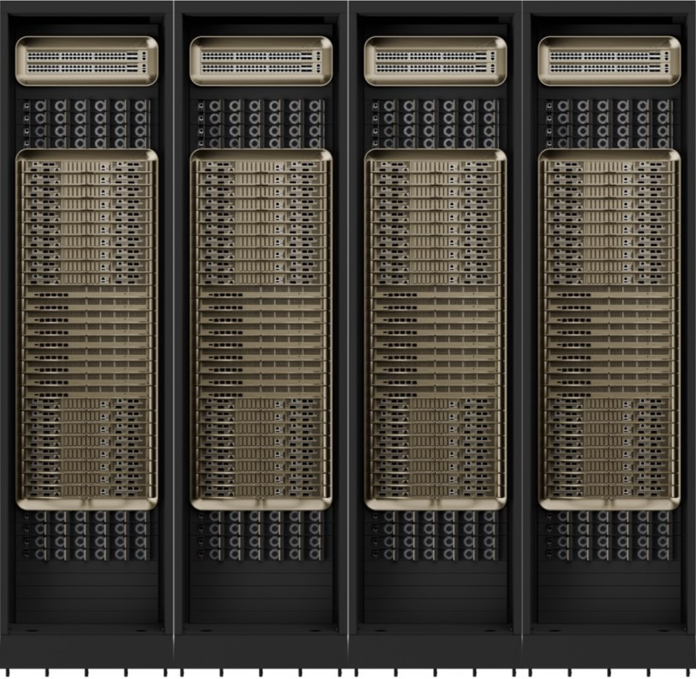
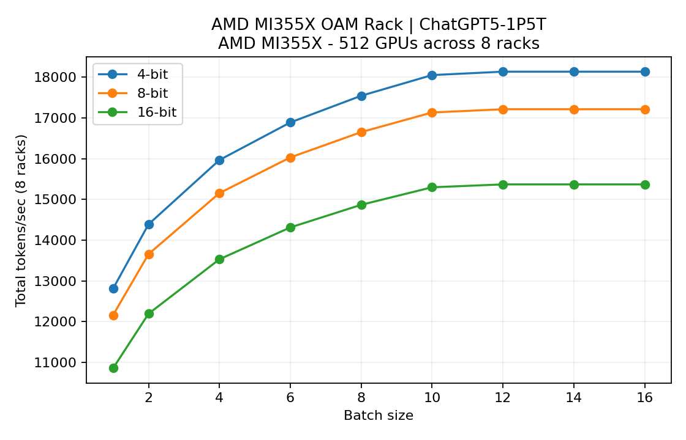

# Data-center AI cluster, rack simulator




A lightweight rack-scale throughput estimator for running frontier LLMs (Qwen3-235B, DeepSeek-V3.2-685B, ChatGPT5-class 1.5T) across multiple data-center compute racks. The Python simulator sweeps tensor/pipeline parallel
plans, quantization (4/8/16 bit), and batch sizes for each hardware preset, then reports the sustained throughput ceiling and the bottleneck (compute, HBM, or fabric) for both inference and training workloads.

The current presets cover 8 racks of:
- NVIDIA GB200 NVL72 cabinets
- NVIDIA GB300 NVL72 cabinets (projected)
- AMD MI300X OAM racks
- AMD MI355X OAM racks (projected)


Note: we include storage servers with 122 TB capacity for users swapping ain and out, but we do not include a provision for database servers to store users accounts.


### Model presets

Quick-select IDs (`--model 1`, `2`, `3`) are available:

| ID | Key                       | Description                              |
|----|---------------------------|------------------------------------------|
| 1  | `qwen3-235b-a22b`         | Qwen3 235B MoE                           |
| 2  | `deepseek-v3.2-exp-685b`  | DeepSeek V3.2 experimental 685B MoE      |
| 3  | `chatgpt5-1p5t`           | ChatGPT5-like 1.5T MoE (long-context)    |

Each run factors in realistic KV-cache traffic, per-link bandwidth ceilings,
and rack-level topology so you can see the optimal number of concurrent model
instances and their tokens/sec.


## Requirements

- Python 3.9+
- `numpy`
- `matplotlib` (only required for the optional plotting step; execution is CLI)

Install dependencies once:

```bash
pip install numpy matplotlib
```

## Running

First thing we want to do is size an inference cluster appropriately given our needs. We use the following optimizer for this.


### Optimization of racks and cluster

An optimizer for data center cluster for an AI LLM inference serving application (eg.: coding AI agent). Optimize for number of racks, type of networking, storage capacity.

Parameters:
- number of active users
- model to be served
- tokens cache needed
- servers used

```
python3 dc_cluster_optimizer.py --active-users 1000 --model 3 --tokens-cached 128000 --max-racks 64 --batch-sizes "1,2,4,8"  --rack-preset "NVIDIA GB200 NVL72 "
```

Output:

```
$ python dc_cluster_optimizer.py --active-users 8000 --model 1 --tokens-cached 128000 --quant-bits 16 --max-racks 128 --batch-sizes "1,2,4,8"  --rack-preset "NVIDIA GB200 NVL72"

Summary Table
-----------------------------------------------------------
Model                              Qwen3-235B-A22B
Rack preset                        NVIDIA GB200 NVL72
Quantisation                       16-bit
Users supported (capacity)         8000 (8064 slots)
KV system                          Plain GB200 host-offload
Batch size per instance            8
TP x PP x EP                       4 x 2 x 1
Servers needed                     1000 (provisioned: 1008)
Racks needed                       112 of type NVIDIA GB200 NVL72
Storage needed (TB)                591.40 TB KV tier
Batches per GPU                    1.00
Networking between servers         NVSwitch / NVLink Switch
Compute util (avg / p95)           4.6% / 5.0%
Network util (avg / p95)           1.2% / 1.3%
Storage util (avg / p95)           77.9% / 85.0%
KV placement (HBM / cache / NVMe)  550781.2 GiB / 0.0 GiB / 0.0 GiB
KV DMA util (avg / p95)            0.0% / 0.0% (512 GB/s link)

Plan details
----------------------------------------
Provisioned GPUs: 8064 (racks 112) | Active GPUs: 8000 | Instances running: 1000/1008 | Tokens/sec capacity: 2094188.9
Compute bound: 2077.6 tok/s per instance | HBM bound: 38105456.2 tok/s | Comm bound: 7881.7 tok/s
KV DMA link (Plain GB200 host-offload): 0.0 GiB cached | util ≈ 0.0% of 512 GB/s
```

Also:
- diagram of cluster
- Plots of optimal configuration and +/- 10% more or less users
- Plots of optimal configuration and +/- 10% more or less batch size
- Plots of optimal configuration and +/- 10% more or less tokens cached


### Simulator with specified parameters:


#### Inference:

```bash
python3 llm_cluster_simulator.py --mode inference --batch-sizes "1,2,4,6,8,10,12,14,16" --model 1 --quant-bits "4"     # qwen3-235b-a22b
python3 llm_cluster_simulator.py --mode inference --batch-sizes "1,2,4,6,8,10,12,14,16" --model 2 --quant-bits "4"     # deepseek-v3.2-exp-685b
python3 llm_cluster_simulator.py --mode inference --batch-sizes "1,2,4,6,8,10,12,14,16" --model 3 --quant-bits "4"     # chatgpt5-1p5t
```

The script prints a table per rack preset. Columns include the batch size,
quantization, total rack throughput, per-instance throughput, optimal
tensor/pipeline split, memory footprint per GPU, and the load each instance
puts on intra-server, inter-server, and inter-rack fabrics.
`--model` accepts either the numeric shortcut (`1`, `2`, `3`) or the full preset key.
Plots are saved as `plots/<rack>_<model>_<mode>.png`, so each model run preserves its own chart artifacts, and every plot overlays the 4/8/16-bit traces for quick comparison (the simulator will compute missing bits if needed to keep the plot complete).

#### Training:

Here we simualte a cluster used for training large AI LLM models.
Switch to training-mode sizing (forward/backward + optimizer traffic) with:

```bash
python3 llm_cluster_simulator.py --mode training --batch-sizes "1,2,4,6,8,10,12,14,16" --model qwen3-235b-a22b --quant-bits "4"
python3 llm_cluster_simulator.py --mode training --batch-sizes "1,2,4,6,8,10,12,14,16" --model deepseek-v3.2-exp-685b  --quant-bits "4"
python3 llm_cluster_simulator.py --mode training --batch-sizes "1,2,4,6,8,10,12,14,16" --model chatgpt5-1p5t          --quant-bits "4"
```

Training summaries add per-instance and aggregate samples/sec (derived from
steps/sec) plus data-parallel gradient load so you can gauge utilisation headroom
on each fabric. Plots in this mode chart total samples processed per second.




#### KV-cache offloading:

Modeling how KV cache is utilized.

```
python3 kv_offload_simulator.py
```

See `docs` for more info.


#### Testing random swap from two LLM models:

```
python3 kv_offload_simulator.py --model qwen3-235b-a22b --batch-size 4 --random-swap --swap-token 128k --swap-steps 1000
python3 kv_offload_simulator.py --model deepseek-v3.2-exp-685b --batch-size 4 --random-swap --swap-token 128k --swap-steps 1000
```

## Computation flow overview

1. Preset selection: for each rack profile we pull the associated GPU capabilities, server topology, and interconnect bandwidths. Quantisation presets determine weight size, sustained compute scaling, and KV precision.
2. Search space sweep: for every batch size and quant setting we iterate tensor-parallel (`tp_candidates`), pipeline-parallel (`pp_candidates`), and expert-parallel (`ep_candidates`) degrees that evenly divide heads, layers,
   and expert shards respectively.
3. Feasibility checks: each `(tp, pp)` pair must fit within rack GPU counts and HBM capacity. Memory usage covers sharded weights, KV cache for cached tokens, plus a small buffer to guard against fragmentation.
4. Throughput estimation: the simulator computes three ceilings per instance: compute (sustained FLOPs, factoring active experts), HBM (KV read bandwidth), and communication (tensor/pipeline collectives plus MoE dispatch). Batch size influences kernel efficiency via an empirical scaling curve.
5. Instance aggregation: the minimum of the three ceilings becomes the instance tokens/sec. We multiply by the number of instances that fit in N racks to get rack-wide throughput and record which subsystem bottlenecks.
6. Reporting and plots: for each rack we print the optimal configuration per batch/quant and plot figures.


## upgrades / to-do list

- Add prefill modelling by sizing activation footprints and read/write bursts.
- Because the simulator assumes steady-state decode, prefill/first-token latency is not modelled. Prefill-heavy workloads typically shift bottlenecks toward HBM or interconnect.
- Introduce heterogeneous racks by instantiating multiple `simulate_rack` calls with different rack counts.
- Emit CSV/JSON by adapting `print_summary` or plugging the returned dict into your own reporting layer.
