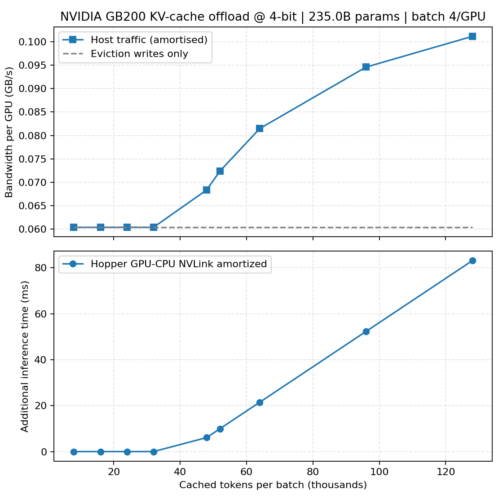

# KV cache offloading from GPU to CPU

During inference, each generated token depends on the Key (K) and Value (V) vectors from all previous tokens in the sequence.
These are stored in GPU memory as the KV-cache so the model doesn’t have to recompute them at every step.

For a large model like Qwen3-235B, which uses high-dimensional hidden states and long contexts, the KV-cache quickly becomes enormous — often larger than the model weights themselves during long-context inference.


See code and run your own experiments [here](https://github.com/culurciello/dc-simulator).


## When offloading becomes necessary
You need to offload (move) part of the KV-cache to CPU memory or another storage tier when the GPU memory capacity is insufficient to hold both:

1- The entire model’s weights (which are read-only), plus

2- The active KV-cache for all tokens and all concurrent inference sessions.

Typical scenarios include:

| Scenario                                              | Why offload is needed                                                                               |
| ----------------------------------------------------- | --------------------------------------------------------------------------------------------------- |
| **Long-context inference** (e.g., 32 K, 128 K tokens) | KV-cache grows linearly with sequence length → can exceed 100 GB per context for very large models. |
| **High batch concurrency**                            | Serving many user requests in parallel requires a separate KV-cache per sequence.                   |
| **Limited GPU memory per accelerator**                | Even high-end GPUs (e.g., GB200 NVL72 node with 144 GB HBM per GPU) can be saturated quickly.       |
| **Mixture-of-Experts (MoE) architectures**            | Each expert might maintain its own KV-cache subset, compounding memory usage.                       |


## What offloading actually means
In frameworks like vLLM, PagedAttention, or DeepSpeed-Inference, offloading means storing portions of the KV-cache in CPU DRAM (or rarely NVMe) when not actively used on the GPU.

Hot pages (recent tokens) stay in GPU memory.
Cold pages (older tokens or inactive sequences) are paged out to host memory.

When needed again (e.g., for attention computation), they’re DMA-transferred back to GPU.
This is transparent to the model but involves careful memory management.


## Why it’s a problem in inference

This can become a major bottleneck, particularly for low-latency or streaming inference scenarios. Several key factors must be considered when deploying LLMs for interactive chatbot applications:

- Time-to-First-Token (TTFT):
TTFT is often dominated by the prefill phase, especially for long-context inputs. When context lengths exceed 8–16k tokens, the initial computation and memory setup can significantly delay the first output token.

- Inter-Token Latency (ITL):
ITL remains low for single-stream decoding, but increases rapidly as GPU compute resources are shared among multiple concurrent user sessions or batched requests.

- Tail Delays:
Latency outliers become pronounced in cases requiring large prompt recomputation, context reshuffling, or reallocation of memory-bound resources. These factors disproportionately affect end-to-end responsiveness and user experience in conversational systems.

All of these factors are essential to preserving a smooth user experience—just as buffering delays can ruin the flow of watching a video, latency spikes or slow responses can break the conversational rhythm with an AI assistant.


## Performance implications:

- Bandwidth gap: CPU DRAM (even over NVLink-C2C or PCIe Gen5) is much slower than GPU HBM (e.g., ~64-128 GB/s vs >1.5 TB/s). Frequent paging can add tens of milliseconds per token in worst cases. Note: The fastest memory for a consumer PC currently uses DDR5 technology, with top speeds in commercially available kits reaching up to 8400 MT/s (approx. 120 GB/s bandwidth). Note2: PCIe 5.0 x16, reaching up to \(64\) GB/s. Note3: 24x DDR5 memory in parallel can reach 1.5 TB/s.

- Latency spikes: If the attention kernel needs a KV page that’s not in GPU memory, the paging delay introduces latency jitter.

- Energy and cost:
Data movement consumes energy and CPU cycles. The performance per watt and cost efficiency drop sharply when offloading is active.

- Complexity: Managing paging tables and ensuring memory consistency adds scheduling overhead.

However, well-designed paging systems (e.g., vLLM’s PagedAttention) use asynchronous prefetching, so offload latency can often be hidden for moderate sequence lengths.

## a practical case

Let’s walk through a realistic, concrete example of how inference works for a Qwen3-235B model in production, showing batching, KV-cache growth, and offloading behavior — and why each effect occurs.


### Scenario 1:

* **Model:** Qwen3-235B (≈ 235 B parameters, dense transformer)
* **Hardware:** 8 × NVIDIA GB200 GPUs (each with 144 GB HBM) connected by NVLink and NVSwitch
* **Inference engine:** TensorRT-LLM or vLLM
* **Serving mode:** Chatbot backend serving many concurrent users
* **Batching goal:** Fill each GPU with ≈ 8 active sessions
* **Average prompt length:** 15 000 tokens per user
* **Generation speed:** 4–5 s per response (standard model) or 10–20 s (reasoning model)


### Step-by-Step Process:

#### 1. Prefill Phase

When users send prompts, the server batches them together (8 at a time) and runs the prefill** to compute the hidden states and initial K/V tensors for each sequence.

- Each user’s 15 K-token prompt produces ~hundreds of MB of K/V data per layer.
- Across 235 B parameters and 70+ layers, the total KV-cache footprint per user can exceed 10–12 GB.
- So, a full batch (8 users) may need ~80–100 GB of cache memory just for K/V data — in addition to model weights.


Thus GPU memory pressure builds immediately.


#### 2. Decode Phase

After prefill, the model generates new tokens (one at a time per user).

- Each GPU kernel fetches the relevant K/V blocks from memory, runs attention, and appends new K/V entries.
- The CPU only orchestrates batch scheduling; all compute stays on GPU.
- As sequences continue, the KV-cache grows linearly with token count and active sessions.

Eventually, total cache > available HBM → the inference framework must decide what to keep “hot” and what to offload.


#### 3. KV-Cache Offloading Triggers

When GPU memory approaches a set threshold (e.g., 90 % full):

* The engine (e.g., vLLM’s PagedAttention) marks older or inactive segments as cold.
* Cold pages are DMA-transferred over NVLink-C2C to Grace CPU memory (or host DRAM).
* The GPU keeps only the most recent tokens’ cache pages for active sessions.

This prevents out-of-memory errors and keeps GPUs utilized, but introduces offload latency.


#### 4. User Interaction Timing

Here’s the dynamic during user interaction with the chat system:

* Users type slowly ≈ 1 prompt per minute.
* GPUs process fast ≈ few seconds per response.

So, after finishing a batch, GPUs may sit idle while waiting for new requests — unless the server reuses those GPUs for other incoming sessions.

When a user resumes (after a minute), the server must:

1. Reload that user’s KV pages from CPU memory (back to GPU).
2. Re-warm the attention state for continuation.
3. Run the next decode step.

→ This reloading step can add tens of milliseconds to hundreds of milliseconds to the first token latency for that user. If many users resume simultaneously, it can briefly spike GPU I/O traffic.

#### 5. Performance Outcome

| Phase                   | Primary bottleneck             | Notes                             |
| ----------------------- | ------------------------------ | --------------------------------- |
| Prefill                 | GPU compute + memory bandwidth | dominated by long-context MatMuls |
| Decode                  | GPU compute                    | KV cache grows linearly           |
| Offload                 | NVLink / PCIe bandwidth        | when cache exceeds HBM capacity   |
| Resume (next user turn) | CPU ↔ GPU DMA transfer         | reload adds latency spikes        |


Even with fast NVLink-C2C, paging slows TTFT by ~50–200 ms per reloaded session.

### Main points:

- KV-cache scales linearly with sequence length × batch size × hidden dim.
- GPU HBM is finite — even 144 GB per GPU is quickly consumed.
- Users are asynchronous, so utilization and cache lifetime vary.
- Offloading is a necessary trade-off to balance throughput and memory capacity.


In real-world Qwen3-235B serving:

- KV-cache offloading is inevitable once context > 8–16 K tokens × multi-user batches.
- It protects system stability but can impact Time-to-First-Token and introduce tail latency spikes.
- The best results come from careful memory-aware batching, cache quantization (FP8/FP4), and asynchronous prefetching to hide offload costs.


## our simulation

We aim to evaluate the impact of KV-cache offloading in a realistic large-scale inference setting, where users dynamically join and leave conversations while their requests are batched across GPUs.
In this scenario, each GPU batch contains roughly eight concurrent user sessions, and each conversation involves long contexts—potentially tens of thousands of tokens.
Although users interact at a low frequency (e.g., one prompt per minute), the GPUs must remain efficiently utilized. Each inference response may take only 4–5 seconds for standard models, or up to 10–20 seconds for more complex reasoning models. This creates a temporal mismatch between the slow arrival rate of user prompts and the high processing throughput of the GPUs, making effective batching and KV-cache management—especially when offloading—critical for maintaining utilization and minimizing latency.

We consider the GB200 NVIDIA server with the new Grace Hopper superchip: 1x CPU + GPU size 1x NV C2C 900GB/s;

See:


## Results for Scenario 1



and also see table: `../plots/kv_table.txt`

This plot show the penalty incurred in KV cach offloading to CPU memory.


## Discussion


### Note 1

Question: Explain the choices of offloading regimes. Why the choices: pessimistic “stream the entire offloaded slice every decode step” and a gentler amortised view where the offloaded slice is fetched once per full generation.

Answer:

- Those two host-read bandwidth figures bracket the likely reality by modeling a worst-case pattern and a more typical
  amortized one:

- The pessimistic “stream everything every step” view assumes that at each decode token you miss cache locally and must re-transfer the entire offloaded KV slice from the host again. That’s equivalent to multiplying the per-token generation rate by the whole offloaded KV footprint. It sets an upper bound on bandwidth needs—useful for sizing interconnects or when locality is terrible.
    
- The amortized estimate assumes better locality: you pay the cost to fetch the offloaded KV once per generation window, then reuse it while producing the window of tokens. We divide the offloaded KV bytes by the total generation time for that window. This aligns with implementations that stage the KV cache into GPU memory opportunistically or overlap fetches, so it’s a more realistic “steady-state” requirement.


Comparing them highlights how traffic could range from “catastrophic thrash” to “bulk warm-up,” helping you decide how much slack the host link must have or what techniques (prefetching, promotion policies) you need to stay closer to the amortized regime.


Think of the script’s “amortized” bandwidth as the steady drip you’d need if one long-running generation keeps streaming
  a partly offloaded KV cache every time it needs those tokens. That maps to scenarios where you interleave many tokens from
  the same conversation (one user) and repeatedly touch the offloaded portion—e.g. autoregressive decoding beyond what fits
  in HBM. The worst-case flag, meanwhile, is the pathological “swap whole cache every token” bound.


### Note 2

Question: Why is the bandwidth per GPU only 0.12 and then it flattens out at 128k tokens?

Answer:

The 0.1–0.12 GB/s numbers are a direct consequence of the slow decode rate this model/GPU pair can sustain. In the simulation the GB200’s usable flops (24 TF/s × 4‑bit scale 1.18) and the Qwen3‑235B MoE’s flops-per-token push the decode into a compute-bound regime, so `tokens_per_sec_instance` settles around 224 tokens/s at batch 1 and roughly 279 tokens/s when you bumped the batch to 4 (`kv_offload_simulator.py:248`). 

With only ~0.206 MB of KV data per token per GPU  (`utils.py:34`, 2 × 94 layers × 1536 hidden × 0.75 B), the eviction stream becomes:

```
evict_bw = tokens_per_sec_per_gpu * kv_bytes_per_token_per_gpu
           ≈ 279 tokens/s * 0.206 MB ≈ 60 MB/s ≈ 0.06 GB/s   (kv_offload_simulator.py:154)
```

That is the majority of the “total amortized GB/s” you’re seeing; the host-read side merely adds a second slice of the same order.

The apparent flattening near 128k tokens comes from the formula for the amortized host read (`kv_offload_simulator.py:159`). Simplifying a bit:

```
  amortized_read_bw = tokens_per_sec_instance * offload_fraction * kv_bytes_per_token_per_gpu
```


Because tokens_per_sec_instance and the per-token KV size stay constant, the only thing that can grow is the offload fraction (tokens you spill ÷ tokens you need). Once that approaches 1, the host read converges on the same 0.06 GB/s ceiling as the eviction stream, so their sum plateaus near 0.12 GB/s.

As for inference rate: with batch size 4 you’re pushing ~279 tokens/s per GPU total, i.e. ~70 tokens/s per stream. A 64k context therefore takes on the order of 64 000 / 70 ≈ 910 s per sequence even before you start generating new tokens—hence the big “generation time” numbers you see in the delay readout, and why the amortized bandwidth remains small. To lift the bandwidth curve you’d need to raise the decode throughput (e.g. faster GPU preset, leaner model, higher batch efficiency) or increase the KV footprint per token (more heads/hidden or denser precision).


### Note 3:

Question: Who is KV offloading performed when switching users during inference. A user has a long context in their history, and needs to be moved in and out of GPUs depending on when they ask questions / prompts. How does this work?

Answer:

The user-handoff workflow: you park a user’s KV cache in host RAM, serve someone else, then pull the first
  user’s cache back when they speak again. That’s more like a burst than a steady stream. In that situation, the right number
  is the one-shot transfer time:

```
  reload_time = offloaded_KV_bytes / link_bandwidth
```


The script already prints that as the “amortized extra” per inference; just interpret it as per-swap latency rather than per-token overhead when the offloaded fraction is high. For example, if user A cached 90 GiB off-device, Hopper NVLinc c2C (900 GB/s) adds roughly 0.14 s to bring them back.


## References

[1] https://developer.nvidia.com/blog/nvidia-grace-hopper-superchip-architecture-in-depth/


