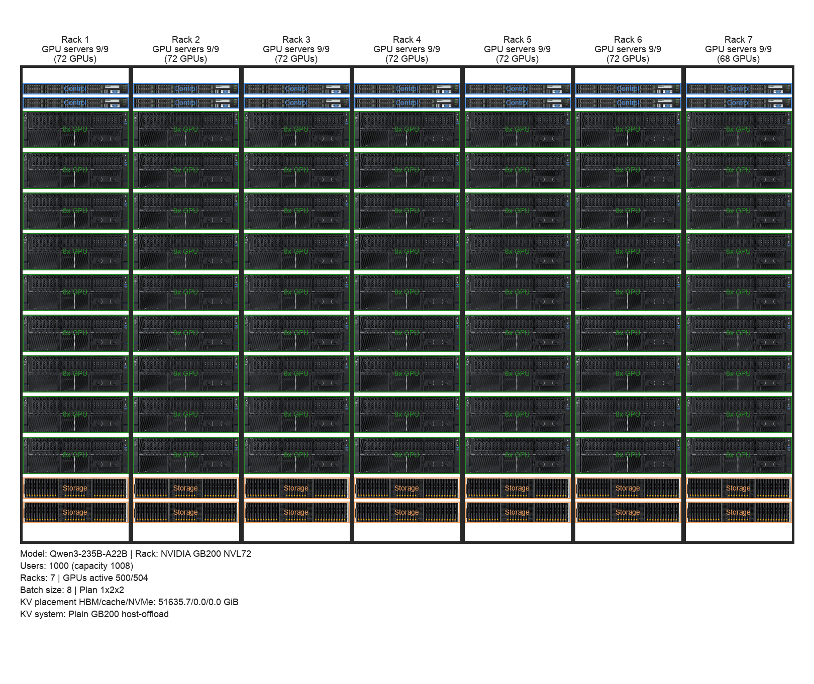

# Results

Here we discuss and present interesting resuls


## sizing up your cluster

For a large inference model

```
$ python3 dc_cluster_optimizer.py --active-users 1000 --model 1 --tokens-cached 128000 --max-racks 12 --batch-sizes "1,2,4,8"  --rack-preset "NVIDIA GB200 NVL72"                                   

Summary Table
-----------------------------------------------------------
Model                              Qwen3-235B-A22B
Rack preset                        NVIDIA GB200 NVL72
Quantisation                       4-bit
Users supported (capacity)         1000 (1008 slots)
KV system                          Plain GB200 host-offload
Batch size per instance            8
TP x PP x EP                       1 x 2 x 2
Servers needed                     63 (provisioned: 63)
Racks needed                       7 of type NVIDIA GB200 NVL72
Storage needed (TB)                27.72 TB KV tier
Storage offloaded (TB)             0.00 TB outside GPU HBM
Storage servers needed             0 (available 14)
Storage capacity provisioned       1708.0 TB @ 2 per rack
Batches per GPU                    2.00
Networking between servers         NVSwitch / NVLink Switch
Compute util (avg / p95)           7.8% / 8.5%
Network util (avg / p95)           0.0% / 0.0%
Storage util (avg / p95)           89.6% / 100.0%
KV placement (HBM / cache / NVMe)  51635.7 GiB / 0.0 GiB / 0.0 GiB
KV DMA util (avg / p95)            0.0% / 0.0% (512 GB/s link)

Plan details
----------------------------------------
Provisioned GPUs: 504 (racks 7) | Active GPUs: 500 | Instances running: 125/126 | Tokens/sec capacity: 154446.4
Compute bound: 1225.8 tok/s per instance | HBM bound: 25403637.4 tok/s | Comm bound: 366661.5 tok/s
KV DMA link (Plain GB200 host-offload): 0.0 GiB cached | util ≈ 0.0% of 512 GB/s
```


Image of resulting cluster, including 2 control servers and 2 storage servers:



Interesting to not the low utilization of compute, only 7-8% on 63 servers and the VERY low utilization of networking. This means that networking can be further downsize to save cost, using standard ethernet switches.


Running the same model but without caching any tokens (see below) in the KV makes utilization of compute jump to ~30% on only 8n servers, demonstrating how offloading KV cache and user to CPU creates a bottleneck to inference utilization for this cluster.


```
$ python3 dc_cluster_optimizer.py --active-users 1000 --model 1 --tokens-cached 4096 --max-racks 12 --batch-sizes "1,2,4,8"  --rack-preset "NVIDIA GB200 NVL72"                                     

Summary Table
-----------------------------------------------------------
Model                              Qwen3-235B-A22B
Rack preset                        NVIDIA GB200 NVL72
Quantisation                       4-bit
Users supported (capacity)         1000 (1152 slots)
KV system                          Plain GB200 host-offload
Batch size per instance            8
TP x PP x EP                       1 x 1 x 1
Servers needed                     16 (provisioned: 18)
Racks needed                       2 of type NVIDIA GB200 NVL72
Storage needed (TB)                0.89 TB KV tier
Storage offloaded (TB)             0.00 TB outside GPU HBM
Storage servers needed             0 (available 4)
Storage capacity provisioned       488.0 TB @ 2 per rack
Batches per GPU                    8.00
Networking between servers         Intra-server NVLink
Compute util (avg / p95)           27.2% / 29.6%
Network util (avg / p95)           0.0% / 0.0%
Storage util (avg / p95)           19.7% / 23.2%
KV placement (HBM / cache / NVMe)  826.2 GiB / 0.0 GiB / 0.0 GiB
KV DMA util (avg / p95)            0.0% / 0.0% (512 GB/s link)

Plan details
----------------------------------------
Provisioned GPUs: 144 (racks 2) | Active GPUs: 125 | Instances running: 125/144 | Tokens/sec capacity: 44127.6
Compute bound: 306.4 tok/s per instance | HBM bound: 12701818.7 tok/s | Comm bound: inf tok/s
KV DMA link (Plain GB200 host-offload): 0.0 GiB cached | util ≈ 0.0% of 512 GB/s
```

Utilization of networking is still VERY low here, even on a much smaller numebr of servers.

With 4096 cached tokens the optimizer only needs ~0.89 TB of total KV cache, so 144 GPUs (18 servers provisioned, 16 in use) can host both weights and KV within the ~160 GiB usable HBM envelope per GPU, keeping a simple 1×1×1 plan. 

When you ask for 128 000 tokens, the KV cache balloons to ~51.6 TB—over 50× more memory. To fit that much KV data under the same per-GPU HBM limit, the optimizer has to add far more GPUs so each one holds a smaller share, and it also increases the pipeline degree (1×2×2) to cut per-GPU KV shards further. That new plan requires 500 active GPUs (63 servers) purely to provide enough HBM, even though compute utilization remains low (~8%).


--
For a large foundational model like chatGPT-5 the results are these:

```
$ python3 dc_cluster_optimizer.py --active-users 1000 --model 3 --tokens-cached 128000 --max-racks 64 --batch-sizes "1,2,4,8"  --rack-preset "NVIDIA GB200 NVL72" --diagram-output plots/cluster_diagram.png

Summary Table
-----------------------------------------------------------
Model                              ChatGPT5-1P5T
Rack preset                        NVIDIA GB200 NVL72
Quantisation                       4-bit
Users supported (capacity)         1000 (1008 slots)
KV system                          Plain GB200 host-offload
Batch size per instance            8
TP x PP x EP                       12 x 1 x 1
Servers needed                     188 (provisioned: 189)
Racks needed                       21 of type NVIDIA GB200 NVL72
Storage needed (TB)                94.37 TB KV tier
Batches per GPU                    0.67
Networking between servers         NVSwitch / NVLink Switch
Compute util (avg / p95)           14.0% / 15.3%
Network util (avg / p95)           6.2% / 6.7%
Storage util (avg / p95)           69.1% / 81.5%
KV placement (HBM / cache / NVMe)  87890.6 GiB / 0.0 GiB / 0.0 GiB
KV DMA util (avg / p95)            0.0% / 0.0% (512 GB/s link)

Plan details
----------------------------------------
Provisioned GPUs: 1512 (racks 21) | Active GPUs: 1500 | Instances running: 125/126 | Tokens/sec capacity: 85760.1
Compute bound: 680.6 tok/s per instance | HBM bound: 44773911.0 tok/s | Comm bound: 1539.8 tok/s
KV DMA link (Plain GB200 host-offload): 0.0 GiB cached | util ≈ 0.0% of 512 GB/s
```


## Inference cluster


## Trainign cluster

